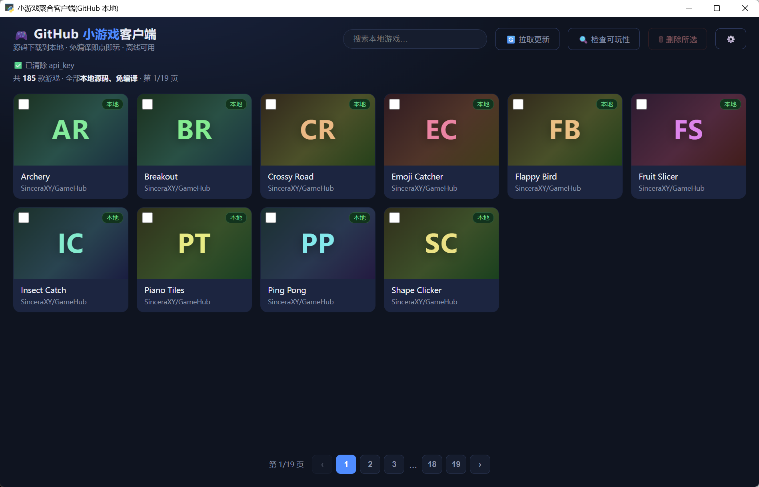
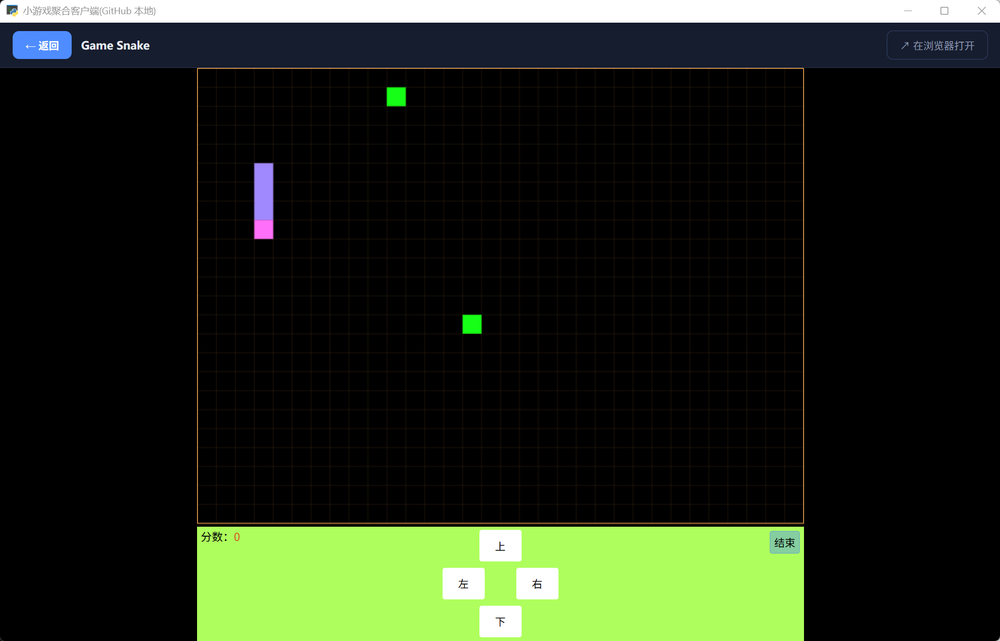
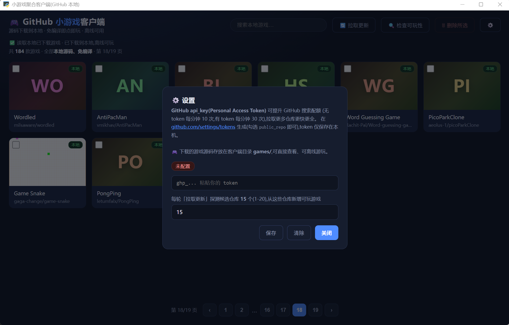

# 小游戏聚合客户端(Mini Game Hub, GitHub 本地版)

基于 Python + pywebview 的桌面客户端:直接从 GitHub 拉取开源小游戏的**源代码文件**到本地,
只保留**免编译、拉取后即可游玩**的静态游戏,点选后在客户端内**离线游玩**。

## 预览

### 游戏列表



### 游戏播放



### 设置



## 特性

- 📥 **源码下载到本地**:文件级拉取(cdn.jsdelivr 直连 + GitHub contents API 回退),
  写入 `games/`,已下载文件自动跳过
- 🚫 **只保留免编译游戏**:根目录存在构建配置(vite/webpack/tsconfig 等)或 package.json 的仓库
  判定为需编译直接跳过;下载后还会自动补齐入口 HTML 引用的 `css/js/img` 资源,
  缺失资源无法补齐的条目不会入库——**开箱即可玩**
- 🔍 **不限深度的增量拉取**:每轮按你的设定(1–20 个候选仓库)沿着 stars 从高到低消费全新仓库;
  单查询翻到 GitHub 1000 条上限后自动按 `stars:` 区间阶梯下探,一直找到 0★,游标持久化、绝不回头重复
- 🗑 **删除 / 批量删除**:每张卡勾选或悬停 ✕ 删除,同步清理本地源码文件;整仓清空自动删除目录
- 🔍 **可玩性巡检**:「检查可玩性」一键扫描本地库,自动联网补齐缺失资源,彻底无法游玩的自动移除
- 🔑 **api_key 提升配额**:「⚙️ 设置」粘贴 GitHub token,搜索配额 10→30 次/分钟,搜索更全
- 🖥️ **本地播放,完全离线**:下载后的游戏走本地 HTTP 服务(127.0.0.1)播放,无跨域/黑屏问题,
  断网也能玩,游戏源码可在 `games/` 目录直接查看

## 运行

需要 Python 3.9+。

```bash
pip install -r requirements.txt
python main.py
```

可选:设置环境变量 `GITHUB_TOKEN`,或在界面「⚙️」里保存 api_key。

## 目录结构

```
01-mini-game-hub/
├── main.py            # 入口:启动本地服务 + pywebview 壳 + API(进度/删除/巡检)
├── github_source.py   # GitHub 源:搜索游标 + star 阶梯 → 文件树枚举 → 免编译过滤 → 下载 → 缓存
├── local_server.py    # 本地静态 HTTP 服务(127.0.0.1:8765,games 目录)
├── config.py          # api_key / 候选仓库数存取(config.json 已 gitignore)
├── web/index.html     # 前端(网格/搜索/进度/设置/删除/播放)
├── games/             # 下载到本地的游戏源码(运行后生成,已 gitignore)
├── data/              # 本地游戏清单 / 搜索游标 / 黑名单(已 gitignore)
└── requirements.txt
```

## 拉取与游玩逻辑

1. **搜索候选仓库**:3 个精选免编译合集(GameHub / mini-browser-games / pacman,
   可在 `github_source.py` 中 `ENABLE_HEAVY_COLLECTIONS=True` 追加中文合集 game-space)
   + Search API(`topic:html5-game` 等,过滤引擎/教程类)。
2. **翻页游标**:每条搜索查询记录「当前 star 段 + 页位置」写入 `data/search_cursor.json`,
   每轮从上次落点继续;普通查询翻到底后按 `stars:200..499 → … → stars:0` 逐级下探到 0★。
3. **枚举文件树**:`GET api.github.com/repos/{user}/{repo}/git/trees/{branch}?recursive=1`,
   根含构建配置(`webpack/vite/tsconfig/angular/next` 等)或 package.json → 判定需编译,跳过。
4. **下载文件**:按条目规划需下载的源码文件,jsdelivr 直连,失败回退 contents API(base64);
   已存在文件跳过,单游戏 >100 文件或 >12MB 跳过;下载后自动补齐引用资源并校验可玩。
5. **提取可玩条目**:按仓库结构找可玩 HTML
   (根 index.html / `N-游戏名/index.html` / 分类游戏目录 / 根单文件),并取同目录截图/logo 做封面。
6. **本地播放**:local_server 以 `http://127.0.0.1:端口/owner__repo/...` 提供,
   客户端 iframe 加载,资源相对路径正常解析。

> 注:demo 为技术演示,所下载的开源游戏版权归原作者/仓库所有。
>
> 本目录属于 vibe coding 项目集的一分子,索引见 [仓库根 README](../../README.md)。

## 开发记录(dev log)

这个项目是 vibe coding(对话式 AI 辅助编程)迭代出来的,下面是真实迭代轨迹:

- **第 1 轮「能拉就能玩」**:定核心链路——GitHub 搜仓库 → 文件树枚举 → 拉源码到本地 →
  本地 HTTP 服务 + pywebview 播放。实测发现 `cdn.jsdelivr` 与 `contents API` 双通道下载最稳。
- **第 2 轮「免编译过滤」**:发现一堆搜出来的仓库要 webpack/vite 构建,直接跳过,
  判定规则(根目录有构建配置或 package.json)让库内游戏"拉下来就能玩"。
- **第 3 轮「增量拉取」**:改为每轮定点探测 N 个新仓库;实测撞上 GitHub 搜索 1000 条上限,
  于是给 `_search_repos` 加跨查询翻页 + `data/search_cursor.json` 游标,绝不回头重复。
- **第 4 轮「star 阶梯」**:验证 `stars:200..499 … stars:0` 等排序限定都可用后,查询一路下探到 0★。
- **第 5 轮「修黑名单 bug」**:发现黑名单误写入了已入库仓库,排查到是 `_save_skipped(exclude|…)`
  的取并集写法问题,修正为只合并新被拒仓库。
- **第 6 轮「限流不沉默」**:core 配额打满时 tree 返回 403,`collect_new` 曾静默吞错
  → 改成把 `rate_limited` 显式写进 errors,界面不再"拉了个寂寞"。
- **第 7 轮「删除 / 批量删除」**:后端按 repo+rel 匹配,整仓清空删目录、同仓只删独占文件。
- **第 8 轮「再次保证开箱即玩」**:巡检发现 13 款游戏缺 `css/js/img` 子目录资源(旧版只下根文件),
  写成"起引用的相对资源自动补齐 + 补不了就剔除",对全库做了一次联网修复,179 款 0 缺失。

### 踩过的坑

- 内联 JS 里大量字符串,正则扫资源引用会误报——必须只在真实 HTML 标签与 `<style>` 里提取。
- 搜索游标格式升级过一次(整型页号 → `{kind,page}`),要写兼容迁移,否则旧数据直接崩。
- 相对路径 `web/index.html` 依赖进程 CWD,从仓库根启动会找不到 → 改成 `__file__` 解析。

### 学到的东西

- 写"能跑的代码"比"好看的代码"优先,但**错误必须显式暴露**(限流/跳过都要看得见原因);
- 面向真实限流与网络抖动设计:优先直连 CDN、API 兜底、下载失败自动跳过的多通道策略很值。